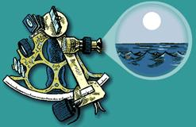
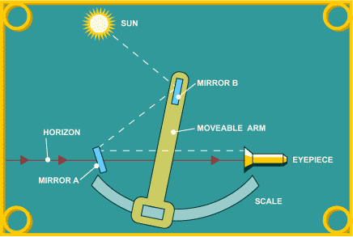
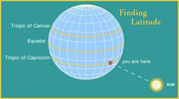
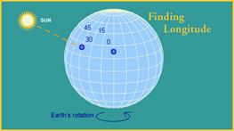

# How To Use A Sextant

## Background

The sextant allows celestial objects to be measured relative to the horizon.  This allows for excellent precision.  The sextant allows direct observation of stars which allows it to be used at night.  For solar observations, filters allow observations of the sun.  Since the measurement is relative to the horizon, the measuring pointer is a beam of light that reaches the horizon.  The measurement is limited only by the angular accuracy of the instrument.  The horizon and celestial object remain steady when viewed through a sextant, even when the user is on a moving ship. This occurs because the sextant views the (unmoving) horizon directly, and views the celestial object through two opposed mirrors that subtract the motion of the sextant from the reflection.

The scale of a sextant has a length of one sixth of a full circle (60°); hence the sextant's name (sextāns, -antis is the Latin word for "one sixth".   Sir Isaac Newton (1643-1727) invented the principle of the doubly reflecting navigation instrument (a reflecting quadrant but never published it.  Two men independently developed the octant around 1730: John Hadley (1682-1744), an English mathematician, and Thomas Godfrey (1704-1749), a glazier in Philadelphia.

## How to Use

The sextant makes use of two mirrors. With this sextant, one of the mirrors (mirror A in the diagram) is half-silvered, which allows some light to pass through. In navigating, you look at the horizon through this mirror.

The other mirror (mirror B in the diagram) is attached to a movable arm. Light from an object, let's say the sun, reflects off this mirror.

The arm can be moved to a position where the sun's reflection off the mirror also reflects off mirror A and through the eyepiece. What you see when this happens is one object (the sun) superimposed on the other (the horizon). The angle between the two objects is then read off the scale. What makes a sextant so useful in navigation is its accuracy.

It can measure an angle with precision to the nearest ten seconds.

(A degree is divided into 60 minutes; a minute is divided into 60 seconds.)

## Navigation by Sextant

There's no way around it: Celestial navigation using a sextant is a complex and involved process that involves a fair amount of calculating, correcting, referring to tables, knowledge of the heavens and the Earth, as well as a lot of common sense.  (No wonder it's been so quickly replaced by the satellite-dependent Global Positioning System, or GPS)
	

But the basic principles behind celestial navigation are fairly straightforward. Here are a few examples that show how a sextant can be used to find location...

Finding latitude is easy enough. The first thing you need to do is measure the angle between the horizon and the sun when the sun is at its highest point, which is right around noontime on your watch. A quick look at your trusty tables tells you which line of latitude the sun should be above on that particular day. For example, let's say it's noon on December 21, and the sun is directly overhead.  Well, on that day the sun is above the Tropic of Capricorn, so your latitude would have to be 23.5 degrees S.

It's a good thing, if you're a navigator, that the Earth spins around at such an even pace. Every hour it moves 15 degrees. This means that if the sun is above the longitude of 0 degrees at noon, one hour later it will be above 15 degrees West. Now if you have a chronometer (this is just a fancy name meaning "extremely accurate clock"), you can find your longitude. Let's say that the sun is directly overhead and your chronometer, which was set to noon when you were at 0 degrees, says it's 3 o'clock position.

This means that three hours ago the sun was overhead at this latitude at 0 degrees longitude. In those three hours, the sun moved 15 degrees 3 times, or 45 degrees. So you're at 45 degrees West. Of course, the fact that the sun was directly overhead (which very rarely happens) made it especially convenient for finding your longitude, but you could have found your longitude anyway, with the help of your tables.

Celestial navigation is the process whereby angles between objects in the sky (celestial objects) and the horizon are used to locate one's position on the globe. At any given instant of time, any celestial object (e.g. the Moon, Jupiter, navigational star Spica) will be located directly over a particular geographic position on the Earth. This geographic position is known as the celestial object’s sub-point, and its location (e.g. its latitude and longitude) can be determined by referring to tables in a nautical or air almanac.

The measured angle between the celestial object and the horizon is directly related to the distance between the subpoint and the observer, and this measurement is used to define a circle on the surface of the Earth called a celestial line of position (LOP). The size and location of this circular line of position can be determined using mathematical or graphical methods (discussed below). The LOP is significant because the celestial object would be observed to be at the same angle above the horizon from any point along its circumference at that instant.
